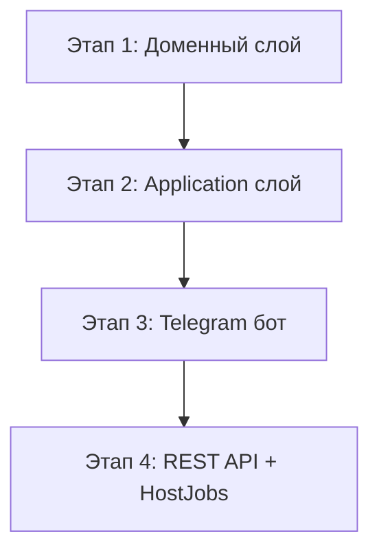

# План реализации BJ-5: HabitLog, статистика, напоминания

## Обзор

Реализация фичи "Отметка выполнения привычки + статистика + вечерние напоминания" в 4 этапа.

---

## Этап 1: Доменный слой (ДН, 1 день)

### 1.1. Миграция БД
- [ ] Новая миграция: `Add_HabitLog` (таблица уже существует, проверить схему)
- [ ] Индексы: `IX_HabitLog_HabitId_Date` (для upsert), `IX_HabitLog_Date` (для напоминаний)

### 1.2. Конфигурация
- [ ] `HabitLogConfiguration` — добавить FK, индексы, `IsCompleted` требует `false` по умолчанию

---

## Этап 2: Application слой (2 дня)

### 2.1. Новый репозиторий
- [ ] `IHabitLogRepository` + `HabitLogRepository`
- [ ] Спецификации: `HabitLogByHabitSpec`, `HabitLogByDateSpec`, `HabitLogByHabitAndDateSpec`

### 2.2. Сервис `IHabitService`
- [ ] `LogAsync(LogHabitCommand)` — upsert лога
- [ ] `GetStatsAsync(GetHabitStatsQuery)` — streak, monthly, calendar
- [ ] `GetLogsAsync(GetHabitLogsQuery)` — список логов
- [ ] `GetByIdAsync(Guid habitId)` — получить привычку по ID (для проверки пользователя)

### 2.3. DTO / Records
- [ ] `LogHabitCommand`, `GetHabitStatsQuery`, `GetHabitLogsQuery`
- [ ] `HabitLogResponse`, `HabitStatsResponse`, `MonthlyStats`, `CalendarDay`
- [ ] `StatsPeriod` enum

---

## Этап 3: Telegram бот (3 дня)

### 3.1. Новые `PendingAction`
- [ ] `AwaitingHabitSelect` — выбор привычки из списка
- [ ] `AwaitingHabitLogDate` — ввод даты вручную
- [ ] `AwaitingStatsHabitSelect` — выбор привычки для статистики

### 3.2. Новые `IPendingInputHandler`
- [ ] `HabitSelectHandler` — принимает число → показывает подменю
- [ ] `HabitLogDateInputHandler` — парсит дату, вызывает сервис
- [ ] `StatsHabitSelectHandler` — принимает число → статистика

### 3.3. Callback-константы (`HabitCallbacks`)
- [ ] `MarkToday`, `MarkOtherDate`, `MarkSkip`
- [ ] `MarkYesterday`, `MarkDayBeforeYesterday`, `MarkCustomDate`
- [ ] `ToggleHabit_{habitId}` — для напоминания (уникальный callback на каждую привычку)
- [ ] `ConfirmChecklist` — подтверждение выбора

### 3.4. `HabitsCallbackHandler`
- [ ] Новые case: `MarkToday`, `MarkOtherDate`, `MarkSkip`, `ToggleHabit_*`, `ConfirmChecklist`

### 3.5. `HabitsMenuService`
- [ ] `OpenHabitMenuAsync(habitId)` — подменю привычки
- [ ] `OpenDatePickerAsync()` — выбор даты
- [ ] `OpenStatsAsync()` — выбор привычки для статистики
- [ ] `OpenStatsForHabitAsync(habitId)` — отображение статистики
- [ ] `ShowMarkResultAsync()` — результат отметки
- [ ] `SendChecklistAsync()` — отправка чек-листа (вечернее напоминание)
- [ ] `ConfirmChecklistAsync()` — фиксация выбора

### 3.6. Меню
- [ ] `HabitsListMenuBuilder` — обычный текст с нумерацией
- [ ] `HabitMenuBuilder` — подменю (✅ 📅 ❌)
- [ ] `HabitStatsBuilder` — отображение статистики
- [ ] `ChecklistBuilder` — сообщение с toggle-кнопками

---

## Этап 4: REST API + HostJobs (2 дня)

### 4.1. Контроллер `HabitController`
- [ ] `POST /api/v1/habits/{id}/log` — отметка
- [ ] `GET /api/v1/habits/{id}/stats` — статистика
- [ ] `GET /api/v1/habits/logs` — логи

### 4.2. `HostJobs` — фоновые напоминания
- [ ] Подключить Hangfire (или `IHostedService` с `PeriodicTimer`)
- [ ] Регистрация сервиса: `IHabitLogService` / `HabitLogBackgroundService`
- [ ] Метод `SendEveningRemindersAsync()` — раз в минуту проверять пользователей

### 4.3. DI-регистрация
- [ ] `AddScoped<IHabitLogRepository, HabitLogRepository>()`
- [ ] `AddScoped<IPendingInputHandler, HabitSelectHandler>()`
- [ ] `AddScoped<IPendingInputHandler, HabitLogDateInputHandler>()`
- [ ] `AddScoped<IPendingInputHandler, StatsHabitSelectHandler>()`
- [ ] `AddHostedService<HabitLogBackgroundService>()` (если не Hangfire)

---

## Граничные случаи (по ходу)

- [ ] Дата в будущем → 400
- [ ] Привычка не найдена → 404
- [ ] Дублирование отметки → upsert
- [ ] Некорректный формат даты → ошибка, не сбрасывать `PendingAction`
- [ ] Нет привычек → напоминание не отправляется
- [ ] Нет `ReminderEveningTime` → молча не отправлять

---

## Статус

| Этап | Статус |
|------|--------|
| 1. Доменный слой | ⏳ |
| 2. Application слой | ⏳ |
| 3. Telegram бот | ⏳ |
| 4. REST API + HostJobs | ⏳ |

**Ветка:** `BJ-5-habitlog-mark-statistics`